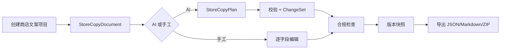

# Launch Studio 商店文案（Store Copy）第一阶段实施计划

> **供执行 Agent 使用：** 每个任务严格执行红灯测试、最小实现、绿灯、提交；不要把多个任务合并成一个提交。宣称完成前运行完整验证。

**目标：** 在 Launch Studio 现有桌面端、Daemon HTTP API 与 `od` CLI 中交付 App Store / Google Play 英文商店文案工作流：一次生成完整字段、逐字段编辑/重新生成、确定性字符与合规检查、字段锁定、版本快照/恢复与导出。

**依据规格：** `specs/current/launch-studio-store-copy-design.md`。

**技术栈：** 与商店截图第一阶段一致（Node 24、pnpm 10.33.2、TS 5.9、Zod 3.25、React 18、Next.js 16、Express 5、better-sqlite3、JSZip、Vitest）。

## 0. 实施约束

1. 使用 `corepack pnpm`，实际版本为仓库锁定的 `10.33.2`。
2. 任何 UI 能力必须同时有 HTTP API 和 `od` CLI；长文本参数支持 `--prompt-file <path|->`，机器输出支持 `--json`。
3. 业务契约只放 `packages/contracts`；纯领域逻辑放 `packages/store-copy`；两者不依赖浏览器、Electron、SQLite 或文件系统。
4. 测试放各包同级 `tests/`；daemon 持久化根目录来自 `OD_DATA_DIR` / `RUNTIME_DATA_DIR`。
5. 每个任务独立提交；不在源码/测试/文档中写入真实 API Key。
6. 第一阶段只做 `en-US`；AI 多语言生成、其他平台与社交文案不在本计划内。

## 1. 目标目录与数据流

```text
packages/store-copy
  ├── src/schema.ts
  ├── src/platforms.ts
  ├── src/compliance.ts
  ├── src/changeset.ts
  ├── src/derive.ts
  └── src/export.ts

apps/daemon/src/store-copy
  ├── persistence.ts
  ├── planner.ts
  ├── service.ts
  ├── routes.ts
  └── cli.ts

apps/web/src/features/store-copy
  ├── api.ts
  ├── StoreCopyWorkspace.tsx
  ├── CopyFieldEditor.tsx
  ├── CopyPlanReview.tsx
  ├── CompliancePanel.tsx
  └── VersionHistory.tsx
```



项目目录布局：

```text
store-copy/
  document.json
  versions/000001.json
  exports/<job-id>/
    manifest.json
    en-US/app-store.json
    en-US/app-store.md
    en-US/google-play.json
    en-US/google-play.md
    launch-studio-store-copy.zip
```

## 任务 1：建立纯领域包与规范 Schema

### 1.1 先写失败测试

`packages/store-copy/tests/schema.test.ts`：

- 合法 `StoreCopyDocument`（app-store）通过；
- 缺失必填字段 / 未知字段 / 非法 platform / 非法 locale 拒绝；
- 字段 `locked`/`confirmed` 默认值与显式赋值；
- `StoreCopyPlan` 校验：合法通过，超长字段拒绝，未知字段拒绝。

### 1.2 最小实现

- `package.json`（`@launch-studio/store-copy`，mirror `@launch-studio/store-screenshot` 的构建/测试脚本）；
- `tsconfig.json`、`tsconfig.tests.json`、`esbuild.config.mjs`；
- `src/schema.ts`：Zod Schema 与 TS 类型。

### 1.3 验证并提交

```bash
pnpm --filter @launch-studio/store-copy typecheck
pnpm --filter @launch-studio/store-copy test
```

提交：`feat(store-copy): add domain schema for store copy documents`。

## 任务 2：实现平台规格与初始文档派生

### 2.1 先写失败测试

`tests/platforms.test.ts`：

- App Store 字段集与上限常量（30/30/170/4000/100/170/40）；
- Google Play 字段集与上限（50/80/4000/80/500/40，tags 规则）；
- `deriveEmptyDocument(platform)` 生成含默认空字段的文档；
- `deriveTemplateDocument(platform, productName)` 预填 name 并标记 `locked: false`。

### 2.2 最小实现

- `src/platforms.ts`：`PLATFORM_SPECS`（字段 id、label、上限、必填、多行/单行、截图标题数量）；
- `src/derive.ts`：空文档与模板文档。

### 2.3 验证并提交

提交：`feat(store-copy): add platform specs and document derivation`。

## 任务 3：实现确定性合规检查

### 3.1 先写失败测试

`tests/compliance.test.ts`：

- 超长字段 → `EXCEEDS_LIMIT` error；
- 必填空字段 → `REQUIRED_EMPTY` error；
- Keywords 重复词 → 去重后的 `DUPLICATE_KEYWORD` warning + 建议；
- Keywords 含品牌词 → `BRAND_KEYWORD` warning；
- 禁用表达（brand voice forbiddenPhrases + 内置 deny-list）→ `FORBIDDEN_TERM` warning；
- 绝对化承诺 → `ABSOLUTE_CLAIM` warning；
- description 与 shortDescription ≥80% 相同 → `DUPLICATE_CONTENT` warning；
- locked 且空 → `LOCKED_FIELD_EMPTY` warning；
- error 与 warning 的 severity 归类。

### 3.2 最小实现

- `src/compliance.ts`：`checkCompliance(document, brandProfile)` → `ComplianceReport`；
- 内置 deny-list 与品牌词过滤输入（`brandProfile.brandTerms`、`brandProfile.forbiddenPhrases`）。

### 3.3 验证并提交

提交：`feat(store-copy): add deterministic compliance checks`。

## 任务 4：实现 ChangeSet（锁定保护）

### 4.1 先写失败测试

`tests/changeset.test.ts`：

- 从 plan 生成 ChangeSet，只包含非锁定字段差异；
- 锁定字段出现在 plan 中 → 跳过并在摘要中记录 `skipped: [field]`；
- 应用 ChangeSet 后返回 `before/after` 映射；
- 超限字段在应用前被拒绝（`EXCEEDS_LIMIT`）；
- 空 plan 返回无变更；
- 恢复路径：`applyVersionSnapshot` 生成 `source: 'restored'` 的新文档且不破坏历史。

### 4.2 最小实现

- `src/changeset.ts`：`buildChangeSet(document, plan)`、`applyChangeSet(document, changeSet)`。

### 4.3 验证并提交

提交：`feat(store-copy): add lock-aware changeset application`。

## 任务 5：实现导出渲染（JSON / Markdown / manifest）

### 5.1 先写失败测试

`tests/export.test.ts`：

- JSON 渲染与输入文档一致（字段顺序固定）；
- Markdown 按平台字段顺序输出标题 + 内容 + 字符数 + 合规状态；
- manifest 含 jobId、locale、平台、字段数、合规计数与文件 SHA-256；
- 多平台导出目录结构（en-US/app-store.json 等）。

### 5.2 最小实现

- `src/export.ts`：`renderJsonDocument`、`renderMarkdown`、`buildManifest`、`renderExportTree`（纯数据，不碰文件系统）。

### 5.3 验证并提交

提交：`feat(store-copy): render JSON, Markdown and export manifest`。

## 任务 6：共享契约与 Daemon 持久化

### 6.1 先写失败测试

- `packages/contracts/tests/...`：`StoreCopyDocumentDto`、`StoreCopyPlanDto`、路由 DTO（create/get/generate/apply/patch/compliance/versions/restore/export）成功与拒绝用例；
- `apps/daemon/tests/store-copy-persistence.test.ts`：文档写读、版本快照、损坏恢复、SQLite 索引。

### 6.2 最小实现

- `packages/contracts/src/api/store-copy.ts` 契约类型；
- `apps/daemon/src/store-copy/persistence.ts`：`createStoreCopyPersistence(db, projectStorage)`，文档与版本存项目目录，SQLite 只存索引。

### 6.3 验证并提交

提交：`feat(store-copy): add shared contracts and daemon persistence`。

## 任务 7：实现 AI 规划与业务编排

### 7.1 先写失败测试

- `tests/store-copy-planner.test.ts`：plan 结构校验、provider 错误透传、无 provider 精确错误；
- `tests/store-copy-service.test.ts`：create/generate/apply/patch/compliance/versions/restore/export 全链路与锁定语义。

### 7.2 最小实现

- `apps/daemon/src/store-copy/planner.ts`：复用现有结构化 JSON provider 通道（参考 store-screenshots/planner.ts）；
- `apps/daemon/src/store-copy/service.ts`：业务编排，串联持久化、planner、changeset、compliance、export。

### 7.3 验证并提交

提交：`feat(store-copy): add AI planner and service orchestration`。

## 任务 8：实现 HTTP API

### 8.1 先写失败测试

`tests/store-copy-routes.test.ts`：路由契约（成功、400 校验失败、404 缺失文档、锁定保护、导出返回 job）。

### 8.2 最小实现

- `apps/daemon/src/store-copy/routes.ts`：`registerStoreCopyRoutes(app, ctx)`，前缀 `/api/projects/:projectId/store-copy`；
- `apps/daemon/src/server.ts` 接线（db、projectStorage、planner、service）。

### 8.3 验证并提交

提交：`feat(store-copy): expose store copy HTTP API`。

## 任务 9：实现 `od store-copy` CLI

### 9.1 先写失败测试

`tests/store-copy-cli.test.ts`（stub server，沿用 cli-templates 模式）：create/get/generate/apply/patch/compliance/versions/restore/export 的请求路径与 body、`--json` 输出、`--prompt-file` 读取。

### 9.2 最小实现

- `apps/daemon/src/store-copy/cli.ts` + `SUBCOMMAND_MAP` 注册；
- usage 帮助文本。

### 9.3 验证并提交

提交：`feat(store-copy): add od store-copy CLI`。

## 任务 10：实现 Web 工作台

### 10.1 先写失败测试

`apps/web/tests/features/store-copy/`：

- api.ts 请求契约；
- Workspace 渲染：平台标签、字段列表、字符数、锁定开关、合规面板；
- 字段编辑/锁定/重新生成交互；
- CopyPlanReview 应用与拒绝；
- 版本历史恢复。

### 10.2 最小实现

- `apps/web/src/features/store-copy/` 组件；
- 新建项目入口与 `FileWorkspace` 接入（参考商店截图接入点）。

### 10.3 验证并提交

提交：`feat(store-copy): add web workspace`。

## 任务 11：端到端测试与验收文档

### 11.1 端到端

- `e2e/tests/specs/store-copy/main.spec.ts`（HTTP/CLI 规格）；
- `e2e/ui/store-copy.test.ts`（真实浏览器手工路径：创建 → 编辑 → 锁定 → 合规 → 导出）；
- 视觉基线（如可行）。

### 11.2 验收

按设计规格第 14 节逐项记录；AI 路径如 Provider 额度仍受阻，记录受阻状态与恢复方式（同商店截图路径 B 模式）。

### 11.3 验证并提交

```bash
pnpm guard
pnpm typecheck
pnpm i18n:check
pnpm --filter @launch-studio/store-copy test
pnpm --filter @open-design/contracts test
pnpm --filter @open-design/daemon test
pnpm --filter @open-design/web test
```

提交：`docs(store-copy): record phase one acceptance`。
