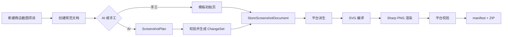

# Launch Studio 商店截图第一阶段实施计划

> **供执行 Agent 使用：** 实施时必须使用 `superpowers:subagent-driven-development`
>（推荐，同一任务中逐项实现与复核）或 `superpowers:executing-plans`（独立执行会话），并在
> 宣称完成前使用 `superpowers:verification-before-completion`。

**目标：** 在 Open Design 现有桌面端、Daemon HTTP API 与 `od` CLI 中交付一条完整的
App Store / Google Play 手机竖屏截图工作流，包括结构化生成、手工编辑、确定性渲染、
平台校验、版本恢复和 ZIP 导出。

**架构：** 使用一份 `StoreScreenshotDocument` 作为唯一事实来源。纯 TypeScript 领域包负责
Schema、模板、变更集、平台派生和 SVG 编译；Daemon 负责 SQLite 索引、项目目录快照、AI
规划、后台任务、Sharp PNG 渲染和 ZIP 导出；Web 端在 Open Design 的左右分栏中将右侧
`FileWorkspace` 替换为专用截图工作台，Fabric.js 仅承载当前页精细编辑。

**技术栈：** Node.js 24、pnpm 10.33.2、TypeScript 5.9、Zod 3.25、React 18、
Next.js 16、Fabric.js 7.4、Express 5、better-sqlite3 12、Sharp 0.34.5、JSZip 3、
Vitest 4、Playwright。

**依据规格：**

- `specs/current/launch-studio-store-screenshot-design.md`
- 上游基线 `nexu-io/open-design@f52fda29a8a6fc65c501a45bb165b6f5208194a1`

## 0. 实施约束

1. 使用 `corepack pnpm`，确保实际版本为仓库锁定的 `10.33.2`。
2. 启动开发环境只使用 `corepack pnpm tools-dev`。
3. 任何 UI 能力必须同时有 HTTP API 和 `od` CLI；长文本参数必须支持
   `--prompt-file <path|->`，机器输出必须支持 `--json`。
4. 业务契约只放在 `packages/contracts`，纯领域逻辑放在
   `packages/store-screenshot`，二者都不能依赖浏览器、Electron、SQLite 或文件系统。
5. 测试放在各包同级 `tests/` 目录，不放入 `src/`。
6. Daemon 的持久化根目录必须来自 `OD_DATA_DIR` / `RUNTIME_DATA_DIR` 和项目存储接口，
   不得写死用户目录。
7. 每个任务严格执行红灯测试、最小实现、绿灯、提交；不要把多个任务合并成一个提交。
8. 第一阶段只支持手机竖屏：
   - App Store：1290 × 2796 PNG，1–10 张，默认 4 张；
   - Google Play：1080 × 1920 PNG，4–8 张，默认 4 张；
   - 两者都必须输出无透明通道 PNG。

## 1. 目标目录与数据流

```text
packages/store-screenshot
  ├── src/schema.ts          领域 Schema 与类型
  ├── src/platforms.ts       平台规格与数量规则
  ├── src/templates.ts       三个确定性模板
  ├── src/changeset.ts       ChangeSet 校验与应用
  ├── src/derive.ts          规范文档到平台页面派生
  └── src/render-svg.ts      确定性 SVG 编译

apps/daemon/src/store-screenshots
  ├── persistence.ts         SQLite 索引与项目目录快照
  ├── assets.ts              素材校验和受管存储
  ├── planner.ts             AI ScreenshotPlan 生成
  ├── renderer.ts            Sharp PNG 输出与验收
  ├── jobs.ts                后台任务状态机
  ├── service.ts             业务编排
  └── cli.ts                 CLI 子命令

apps/web/src/features/store-screenshots
  ├── api.ts
  ├── StoreScreenshotWorkspace.tsx
  ├── StoreScreenshotGallery.tsx
  ├── StoreScreenshotEditor.tsx
  ├── fabric-adapter.ts
  └── store-screenshot.css
```



项目目录内的规范文件布局：

```text
store-screenshots/
  document.json
  versions/000001.json
  assets/<sha256>.<ext>
  exports/<job-id>/
    app-store/01.png
    google-play/01.png
    manifest.json
    launch-studio-screenshots.zip
```

SQLite 只保存可查询索引和任务状态；`document.json` 与版本快照才是可迁移的项目资产。

---

## 任务 1：建立纯领域包与规范 Schema

**文件：**

- 新建 `packages/store-screenshot/package.json`
- 新建 `packages/store-screenshot/esbuild.config.mjs`
- 新建 `packages/store-screenshot/tsconfig.json`
- 新建 `packages/store-screenshot/tsconfig.tests.json`
- 新建 `packages/store-screenshot/src/schema.ts`
- 新建 `packages/store-screenshot/src/platforms.ts`
- 新建 `packages/store-screenshot/src/index.ts`
- 新建 `packages/store-screenshot/tests/schema.test.ts`
- 修改 `pnpm-lock.yaml`

### 1.1 先写失败测试

```ts
import { describe, expect, it } from 'vitest';
import {
  StoreScreenshotDocumentSchema,
  assertPlatformPageCount,
  platformSpecs,
} from '../src/index.js';

describe('StoreScreenshotDocument', () => {
  it('接受版本化规范文档并拒绝悬空素材引用', () => {
    const result = StoreScreenshotDocumentSchema.safeParse({
      schemaVersion: 1,
      id: 'doc-1',
      projectId: 'project-1',
      version: 1,
      product: { name: 'Focus', summary: '专注任务', audience: '独立开发者', features: ['计时'] },
      designSystemId: 'clay',
      assets: [],
      pages: [{
        id: 'page-1',
        order: 0,
        templateId: 'minimal-center',
        headline: '保持专注',
        body: '一次只做一件事',
        screenshotAssetId: 'missing',
        overrides: {},
        lockedFields: [],
      }],
    });
    expect(result.success).toBe(false);
  });

  it('执行平台数量限制', () => {
    expect(platformSpecs.appStore.size).toEqual({ width: 1290, height: 2796 });
    expect(() => assertPlatformPageCount('googlePlay', 3)).toThrow('4 到 8');
    expect(() => assertPlatformPageCount('appStore', 10)).not.toThrow();
  });
});
```

运行：

```bash
corepack pnpm --filter @launch-studio/store-screenshot test
```

预期：失败，包和导出尚不存在。

### 1.2 最小实现

核心类型必须明确表达共享内容、平台覆盖和锁定字段：

```ts
export type StorePlatform = 'appStore' | 'googlePlay';

export interface StoreScreenshotPage {
  id: string;
  order: number;
  templateId: 'minimal-center' | 'gradient-device' | 'editorial-split';
  headline: string;
  body?: string;
  screenshotAssetId?: string;
  logoAssetId?: string;
  overrides: Partial<Record<StorePlatform, {
    headline?: string;
    body?: string;
    hidden?: boolean;
  }>>;
  lockedFields: Array<'headline' | 'body' | 'template' | 'screenshot' | 'layout'>;
}
```

Zod `superRefine` 必须验证：

- `schemaVersion === 1`；
- 页面 `id` 唯一且 `order` 连续；
- `screenshotAssetId` / `logoAssetId` 必须存在于 `assets`；
- 颜色为 `#RRGGBB`，位置和缩放为有限数值；
- 至少有 1 个规范页面，最多 10 个。

### 1.3 验证并提交

```bash
corepack pnpm --filter @launch-studio/store-screenshot test
corepack pnpm --filter @launch-studio/store-screenshot typecheck
git add packages/store-screenshot pnpm-lock.yaml
git commit -m "feat: add store screenshot domain model"
```

---

## 任务 2：实现模板、平台派生、ChangeSet 与 SVG 编译

**文件：**

- 新建 `packages/store-screenshot/src/templates.ts`
- 新建 `packages/store-screenshot/src/changeset.ts`
- 新建 `packages/store-screenshot/src/derive.ts`
- 新建 `packages/store-screenshot/src/render-svg.ts`
- 新建 `packages/store-screenshot/tests/templates.test.ts`
- 新建 `packages/store-screenshot/tests/changeset.test.ts`
- 新建 `packages/store-screenshot/tests/render-svg.test.ts`
- 修改 `packages/store-screenshot/src/index.ts`

### 2.1 先写失败测试

```ts
it('只修改目标页并保留被锁定标题', () => {
  const next = applyChangeSet(document, {
    baseVersion: 3,
    operations: [
      { op: 'setText', pageId: 'page-1', field: 'headline', value: '不能覆盖' },
      { op: 'setText', pageId: 'page-2', field: 'headline', value: '新标题' },
    ],
  });
  expect(next.pages[0].headline).toBe(document.pages[0].headline);
  expect(next.pages[1].headline).toBe('新标题');
  expect(next.version).toBe(4);
});

it('同一输入生成字节稳定的 SVG', () => {
  const first = compileStoreScreenshotSvg(derivedPage);
  const second = compileStoreScreenshotSvg(derivedPage);
  expect(second).toBe(first);
  expect(first).toContain('width="1290" height="2796"');
});
```

运行：

```bash
corepack pnpm --filter @launch-studio/store-screenshot test
```

预期：失败，函数尚不存在。

### 2.2 最小实现

三个模板固定为：

1. `minimal-center`：纯色背景、居中标题、下部设备截图；
2. `gradient-device`：品牌渐变、左对齐文案、带圆角的产品截图；
3. `editorial-split`：大字号标题、上下分区、强调色标签。

`ChangeSet` 第一阶段只允许以下白名单操作：

```ts
type ChangeOperation =
  | { op: 'setText'; pageId: string; field: 'headline' | 'body'; value: string; platform?: StorePlatform }
  | { op: 'setColor'; pageId: string; field: 'background' | 'accent' | 'text'; value: string }
  | { op: 'setTransform'; pageId: string; x: number; y: number; scale: number }
  | { op: 'setAsset'; pageId: string; assetId: string }
  | { op: 'setVisibility'; pageId: string; visible: boolean; platform?: StorePlatform }
  | { op: 'insertPage'; afterPageId?: string; page: StoreScreenshotPage }
  | { op: 'duplicatePage'; pageId: string }
  | { op: 'deletePage'; pageId: string }
  | { op: 'movePage'; pageId: string; toIndex: number }
  | { op: 'setLocks'; pageId: string; fields: StoreScreenshotPage['lockedFields'] };
```

应用前必须比较 `baseVersion`；不匹配时返回 `VERSION_CONFLICT`，不得静默覆盖。
SVG 编译器必须对文本做 XML 转义、固定属性顺序、固定浮点精度，并把平台尺寸写进根节点。

### 2.3 验证并提交

```bash
corepack pnpm --filter @launch-studio/store-screenshot test
corepack pnpm --filter @launch-studio/store-screenshot typecheck
git add packages/store-screenshot
git commit -m "feat: add deterministic screenshot templates"
```

---

## 任务 3：增加共享 API 契约和项目意图

**文件：**

- 新建 `packages/contracts/src/api/store-screenshots.ts`
- 新建 `packages/contracts/tests/store-screenshots-contract.test.ts`
- 修改 `packages/contracts/src/api/projects.ts`
- 修改 `packages/contracts/src/index.ts`
- 修改 `packages/contracts/esbuild.config.mjs`
- 修改 `packages/contracts/package.json`

### 3.1 先写失败测试

```ts
it('解析创建文档请求和后台任务响应', () => {
  expect(CreateStoreScreenshotDocumentRequestSchema.parse({
    product: {
      name: 'Focus',
      summary: '专注工具',
      audience: '创作者',
      features: ['番茄钟', '统计'],
    },
    designSystemId: 'clay',
    templateId: 'minimal-center',
    pageCount: 4,
  }).pageCount).toBe(4);

  expect(StoreScreenshotJobSchema.parse({
    id: 'job-1',
    type: 'export',
    status: 'queued',
    progress: { completed: 0, total: 8 },
  }).status).toBe('queued');
});
```

### 3.2 最小实现

在 `ProjectMetadata.intent` 增加 `'store-screenshot'`。项目仍使用 `kind: 'image'`，
避免扩大 `ProjectKind` 对分析、媒体和预览路径的影响。
`@open-design/contracts` 通过工作区依赖复用
`@launch-studio/store-screenshot` 的领域 Schema，并在 esbuild 入口和包导出中增加
`./api/store-screenshots`，避免 Web 与 Daemon 各自维护一套请求类型。

共享契约至少包括：

- 创建、读取、更新和恢复文档；
- 上传素材结果；
- `ScreenshotPlan`；
- ChangeSet 预览与确认；
- 校验结果；
- 生成/导出任务和进度；
- 统一错误码：
  `BAD_REQUEST`、`PROJECT_NOT_FOUND`、`DOCUMENT_NOT_FOUND`、`VERSION_CONFLICT`、
  `INVALID_ASSET`、`PLATFORM_VALIDATION_FAILED`、`PROVIDER_NOT_CONFIGURED`、
  `JOB_NOT_FOUND`。

### 3.3 验证并提交

```bash
corepack pnpm --filter @open-design/contracts test
corepack pnpm --filter @open-design/contracts typecheck
git add packages/contracts
git commit -m "feat: define store screenshot API contracts"
```

---

## 任务 4：实现 Daemon 持久化、素材和版本恢复

**文件：**

- 新建 `apps/daemon/src/store-screenshots/persistence.ts`
- 新建 `apps/daemon/src/store-screenshots/assets.ts`
- 新建 `apps/daemon/tests/store-screenshot-persistence.test.ts`
- 新建 `apps/daemon/tests/store-screenshot-assets.test.ts`
- 修改 `apps/daemon/src/db.ts`
- 修改 `apps/daemon/package.json`
- 修改 `pnpm-lock.yaml`

### 4.1 先写失败测试

```ts
it('写入新版本并可恢复旧版本', async () => {
  const store = createStoreScreenshotPersistence(db, projectStorage);
  await store.create(projectId, documentV1);
  await store.save(projectId, documentV2, changeSet, 'manual');
  expect((await store.read(projectId)).version).toBe(2);

  const restored = await store.restore(projectId, 1);
  expect(restored.version).toBe(3);
  expect(restored.pages).toEqual(documentV1.pages);
});

it('拒绝伪造扩展名和超大素材', async () => {
  await expect(assetStore.save(projectId, fakePng)).rejects.toMatchObject({
    code: 'INVALID_ASSET',
  });
});
```

### 4.2 最小实现

在 `db.ts` 增加幂等迁移：

```sql
CREATE TABLE IF NOT EXISTS store_screenshot_documents (
  project_id TEXT PRIMARY KEY,
  document_id TEXT NOT NULL,
  current_version INTEGER NOT NULL,
  relative_path TEXT NOT NULL,
  created_at INTEGER NOT NULL,
  updated_at INTEGER NOT NULL
);
CREATE TABLE IF NOT EXISTS store_screenshot_versions (
  document_id TEXT NOT NULL,
  version INTEGER NOT NULL,
  source TEXT NOT NULL,
  changeset_json TEXT,
  relative_path TEXT NOT NULL,
  created_at INTEGER NOT NULL,
  PRIMARY KEY (document_id, version)
);
CREATE TABLE IF NOT EXISTS store_screenshot_assets (
  id TEXT PRIMARY KEY,
  document_id TEXT NOT NULL,
  relative_path TEXT NOT NULL,
  mime TEXT NOT NULL,
  width INTEGER NOT NULL,
  height INTEGER NOT NULL,
  content_hash TEXT NOT NULL,
  created_at INTEGER NOT NULL
);
CREATE TABLE IF NOT EXISTS store_screenshot_jobs (
  id TEXT PRIMARY KEY,
  project_id TEXT NOT NULL,
  document_id TEXT NOT NULL,
  type TEXT NOT NULL,
  status TEXT NOT NULL,
  progress_json TEXT NOT NULL,
  result_json TEXT,
  error_json TEXT,
  created_at INTEGER NOT NULL,
  started_at INTEGER,
  ended_at INTEGER,
  updated_at INTEGER NOT NULL
);
```

素材处理要求：

- 使用 Sharp 解码而不是信任文件名和请求 MIME；
- 允许 PNG、JPEG、WebP，拒绝 SVG、GIF、视频和超过 20 MiB 的文件；
- 计算 SHA-256，按内容寻址去重；
- 只返回素材 ID 和项目相对路径，不向前端暴露任意绝对路径。

### 4.3 验证并提交

```bash
corepack pnpm --filter @open-design/daemon test -- store-screenshot-persistence store-screenshot-assets
corepack pnpm --filter @open-design/daemon typecheck
git add apps/daemon/src/db.ts apps/daemon/src/store-screenshots apps/daemon/tests/store-screenshot-* apps/daemon/package.json pnpm-lock.yaml
git commit -m "feat: persist store screenshot documents"
```

---

## 任务 5：实现 HTTP API 与服务编排

**文件：**

- 新建 `apps/daemon/src/store-screenshots/service.ts`
- 新建 `apps/daemon/src/routes/store-screenshots.ts`
- 新建 `apps/daemon/tests/store-screenshot-routes.test.ts`
- 修改 `apps/daemon/src/server.ts`
- 修改 `apps/daemon/src/route-context-contract.ts`

### 5.1 先写失败测试

```ts
it('通过 HTTP 创建、修改和恢复截图文档', async () => {
  const created = await request(app)
    .post(`/api/projects/${projectId}/store-screenshots`)
    .send(createBody)
    .expect(201);

  await request(app)
    .post(`/api/projects/${projectId}/store-screenshots/changes/preview`)
    .send({ baseVersion: 1, operations: [renamePage] })
    .expect(200)
    .expect(({ body }) => expect(body.affectedPageIds).toEqual(['page-2']));

  await request(app)
    .post(`/api/projects/${projectId}/store-screenshots/changes/apply`)
    .send({ baseVersion: 1, operations: [renamePage] })
    .expect(200);
});
```

### 5.2 路由集合

```text
POST   /api/projects/:projectId/store-screenshots
GET    /api/projects/:projectId/store-screenshots
POST   /api/projects/:projectId/store-screenshots/assets
POST   /api/projects/:projectId/store-screenshots/changes/preview
POST   /api/projects/:projectId/store-screenshots/changes/apply
GET    /api/projects/:projectId/store-screenshots/versions
POST   /api/projects/:projectId/store-screenshots/versions/:version/restore
POST   /api/projects/:projectId/store-screenshots/validate
POST   /api/projects/:projectId/store-screenshots/generate
POST   /api/projects/:projectId/store-screenshots/export
GET    /api/projects/:projectId/store-screenshots/jobs/:jobId
GET    /api/projects/:projectId/store-screenshots/jobs/:jobId/download
```

所有写路由必须：

- 校验本机 Daemon 请求和项目归属；
- 通过共享 Zod Schema 解析请求；
- 使用 `sendApiError` 返回结构化错误；
- 对版本冲突返回 HTTP 409；
- 对导出下载使用受控相对路径，防止目录穿越。

### 5.3 验证并提交

```bash
corepack pnpm --filter @open-design/daemon test -- store-screenshot-routes
corepack pnpm --filter @open-design/daemon typecheck
git add apps/daemon/src/server.ts apps/daemon/src/route-context-contract.ts apps/daemon/src/routes/store-screenshots.ts apps/daemon/src/store-screenshots/service.ts apps/daemon/tests/store-screenshot-routes.test.ts
git commit -m "feat: expose store screenshot HTTP API"
```

---

## 任务 6：实现确定性 PNG 渲染、校验与 ZIP 导出

**文件：**

- 新建 `apps/daemon/src/store-screenshots/renderer.ts`
- 新建 `apps/daemon/src/store-screenshots/jobs.ts`
- 新建 `apps/daemon/tests/store-screenshot-renderer.test.ts`
- 新建 `apps/daemon/tests/store-screenshot-jobs.test.ts`
- 修改 `apps/daemon/src/store-screenshots/service.ts`

### 6.1 先写失败测试

```ts
it.each([
  ['appStore', 1290, 2796],
  ['googlePlay', 1080, 1920],
])('输出正确尺寸且无 alpha：%s', async (platform, width, height) => {
  const file = await renderer.renderPage(document, pageId, platform);
  const metadata = await sharp(file).metadata();
  expect(metadata).toMatchObject({ width, height, format: 'png', channels: 3 });
});

it('导出包包含稳定命名和 manifest', async () => {
  const result = await exportStoreScreenshots(document, ['appStore', 'googlePlay']);
  expect(result.files).toContain('app-store/01.png');
  expect(result.files).toContain('google-play/04.png');
  expect(result.manifest.documentVersion).toBe(document.version);
});
```

### 6.2 最小实现

渲染管线固定为：

```ts
const png = await sharp(Buffer.from(svg))
  .flatten({ background: derivedPage.background })
  .removeAlpha()
  .png({ compressionLevel: 9, adaptiveFiltering: false })
  .toBuffer();
```

完成后必须重新读取 PNG metadata，检查尺寸、格式和通道数。任务状态只允许：
`queued → running → done | failed | interrupted`。Daemon 重启时把遗留
`queued/running` 标记为 `interrupted`，不伪装成功。

`manifest.json` 至少包含：

- 文档 ID、版本、导出时间；
- 每个平台的规则版本和目标尺寸；
- 文件顺序、文件名、宽高、SHA-256；
- 源页面 ID、模板 ID；
- 校验错误和警告数组。

### 6.3 验证并提交

```bash
corepack pnpm --filter @open-design/daemon test -- store-screenshot-renderer store-screenshot-jobs
corepack pnpm --filter @open-design/daemon typecheck
git add apps/daemon/src/store-screenshots apps/daemon/tests/store-screenshot-renderer.test.ts apps/daemon/tests/store-screenshot-jobs.test.ts
git commit -m "feat: render and export store screenshots"
```

---

## 任务 7：实现 AI ScreenshotPlan 和手工降级路径

**文件：**

- 新建 `apps/daemon/src/structured-json.ts`
- 新建 `apps/daemon/src/store-screenshots/planner.ts`
- 新建 `apps/daemon/tests/store-screenshot-planner.test.ts`
- 新建 `apps/daemon/tests/structured-json.test.ts`
- 修改 `apps/daemon/src/memory-llm.ts`
- 修改 `apps/daemon/src/store-screenshots/service.ts`

### 7.1 先写失败测试

```ts
it('把 Provider JSON 校验成 ScreenshotPlan', async () => {
  const planner = createStoreScreenshotPlanner({
    generateJson: async () => ({
      strategy: '从痛点到结果',
      pages: [
        { headline: '夺回注意力', body: '屏蔽干扰', feature: 'focus', templateId: 'minimal-center' },
        { headline: '看见进展', body: '每周复盘', feature: 'stats', templateId: 'editorial-split' },
        { headline: '形成节奏', body: '智能提醒', feature: 'reminder', templateId: 'gradient-device' },
        { headline: '今天开始', body: '完成第一轮专注', feature: 'timer', templateId: 'minimal-center' },
      ],
    }),
  });
  expect((await planner.plan(input)).pages).toHaveLength(4);
});

it('没有 Provider 时返回可识别错误且不影响手工创建', async () => {
  await expect(planner.plan(input)).rejects.toMatchObject({ code: 'PROVIDER_NOT_CONFIGURED' });
  expect(createDocumentFromTemplate(input).pages).toHaveLength(4);
});
```

### 7.2 最小实现

把 `memory-llm.ts` 中已验证的“当前本地 CLI / BYOK Provider → 严格 JSON”能力抽为
`structured-json.ts`，保持原有记忆提取测试全部通过。公共入口：

```ts
export interface StructuredJsonRequest<T> {
  system: string;
  user: string;
  schema: z.ZodType<T>;
  chatAgentId?: string;
}

export async function generateStructuredJson<T>(
  request: StructuredJsonRequest<T>,
  deps: StructuredJsonDeps,
): Promise<T>;
```

截图系统提示必须：

- 只返回 `ScreenshotPlan` JSON；
- 使用 Product Profile 中真实功能，不编造价格、评分、奖项和量化收益；
- 默认 4 页，并形成“价值主张 → 核心功能 → 证明/场景 → 行动”叙事；
- 仅使用三个已注册模板；
- 不直接修改文档，先转成可预览 ChangeSet。

模型输出最多修复一次 JSON；再次失败返回 `INVALID_PROVIDER_RESPONSE`，保留原文摘要到
任务错误中，但不得写入 API key。

### 7.3 验证并提交

```bash
corepack pnpm --filter @open-design/daemon test -- structured-json store-screenshot-planner memory
corepack pnpm --filter @open-design/daemon typecheck
git add apps/daemon/src/structured-json.ts apps/daemon/src/memory-llm.ts apps/daemon/src/store-screenshots apps/daemon/tests/structured-json.test.ts apps/daemon/tests/store-screenshot-planner.test.ts
git commit -m "feat: generate structured screenshot plans"
```

---

## 任务 8：实现 `od store-screenshot` CLI 能力对等

**文件：**

- 新建 `apps/daemon/src/store-screenshots/cli.ts`
- 新建 `apps/daemon/tests/store-screenshot-cli.test.ts`
- 修改 `apps/daemon/src/cli.ts`

### 8.1 先写失败测试

```ts
it('支持从 stdin 读取长提示并输出 JSON', async () => {
  const result = await runCli(
    ['store-screenshot', 'generate', projectId, '--prompt-file', '-', '--json'],
    { stdin: '面向独立开发者，突出无干扰专注和周报' },
  );
  expect(result.exitCode).toBe(0);
  expect(JSON.parse(result.stdout)).toMatchObject({ ok: true, jobId: expect.any(String) });
});
```

### 8.2 子命令

```text
od store-screenshot create <project-id> [--input <json>] [--json]
od store-screenshot upload <project-id> <file> [--json]
od store-screenshot generate <project-id> --prompt-file <path|-> [--json]
od store-screenshot validate <project-id> [--platform app-store|google-play|all] [--json]
od store-screenshot export <project-id> [--platform app-store|google-play|all] [--output <dir>] [--wait] [--json]
od store-screenshot status <project-id> <job-id> [--json]
od store-screenshot versions <project-id> [--json]
od store-screenshot restore <project-id> <version> [--json]
```

CLI 只调用 HTTP API，不复制业务逻辑；错误通过现有 `structuredHttpFailure` 输出。

### 8.3 验证并提交

```bash
corepack pnpm --filter @open-design/daemon test -- store-screenshot-cli
corepack pnpm --filter @open-design/daemon typecheck
git add apps/daemon/src/cli.ts apps/daemon/src/store-screenshots/cli.ts apps/daemon/tests/store-screenshot-cli.test.ts
git commit -m "feat: add store screenshot CLI"
```

---

## 任务 9：增加新建项目入口和专用工作区

**文件：**

- 修改 `apps/web/src/components/NewProjectPanel.tsx`
- 修改 `apps/web/src/components/ProjectView.tsx`
- 修改 `apps/web/src/state/projects.ts`
- 新建 `apps/web/src/features/store-screenshots/api.ts`
- 新建 `apps/web/src/features/store-screenshots/StoreScreenshotWorkspace.tsx`
- 新建 `apps/web/src/features/store-screenshots/StoreScreenshotGallery.tsx`
- 新建 `apps/web/src/features/store-screenshots/store-screenshot.css`
- 新建 `apps/web/tests/features/store-screenshots/workspace.test.tsx`
- 修改 `apps/web/tests/components/NewProjectPanel.test.tsx`
- 修改 `apps/web/src/i18n/types.ts`
- 修改 `apps/web/src/i18n/locales/en.ts`
- 修改 `apps/web/src/i18n/locales/zh-CN.ts`
- 修改其余 `apps/web/src/i18n/locales/*.ts`

### 9.1 先写失败测试

```tsx
it('创建商店截图项目并保留 Design System', async () => {
  render(<NewProjectPanel {...props} />);
  fireEvent.click(screen.getByRole('tab', { name: '商店截图' }));
  fireEvent.change(screen.getByTestId('new-project-name'), { target: { value: 'Focus 商店图' } });
  fireEvent.click(screen.getByTestId('create-project'));

  expect(props.onCreate).toHaveBeenCalledWith(expect.objectContaining({
    designSystemId: 'clay',
    metadata: expect.objectContaining({
      kind: 'image',
      intent: 'store-screenshot',
      platformTargets: ['mobile-ios', 'mobile-android'],
    }),
  }));
});

it('在右侧展示平台切换和四页画廊', async () => {
  render(<StoreScreenshotWorkspace projectId="project-1" />);
  expect(await screen.findAllByTestId('store-screenshot-card')).toHaveLength(4);
  expect(screen.getByRole('tab', { name: 'App Store' })).toHaveAttribute('aria-selected', 'true');
});
```

### 9.2 最小实现

- `NewProjectPanel` 新增 `store-screenshot` 标签，不把它塞进通用媒体标签；
- 创建项目后调用创建文档 API，默认模板 `minimal-center`、默认 4 页；
- `ProjectView` 判断
  `currentProject.metadata?.intent === 'store-screenshot'`，右侧渲染
  `StoreScreenshotWorkspace`，其他项目继续渲染 `FileWorkspace`；
- 保留左侧 `ChatPane`、分栏拖动、项目标题、Provider 和 Design System 选择器；
- 工作区包含平台标签、校验状态、生成/导出按钮、画廊、底部缩略图轨道；
- 未配置 Provider 时隐藏或禁用 AI 生成，并明确显示“可继续手工编辑”。

新增文案在 `en.ts` 和 `zh-CN.ts` 完整翻译；其他语言第一阶段填英文回退，保证 `Dict`
类型和 `i18n:check` 通过，不把整个字典改为 `Partial`。

### 9.3 验证并提交

```bash
corepack pnpm --filter @open-design/web test -- NewProjectPanel workspace
corepack pnpm --filter @open-design/web typecheck
corepack pnpm i18n:check
git add apps/web
git commit -m "feat: add store screenshot workspace"
```

---

## 任务 10：实现 Fabric 精细编辑、ChangeSet 预览和版本恢复 UI

**文件：**

- 新建 `apps/web/src/features/store-screenshots/StoreScreenshotEditor.tsx`
- 新建 `apps/web/src/features/store-screenshots/fabric-adapter.ts`
- 新建 `apps/web/src/features/store-screenshots/ChangeSetReview.tsx`
- 新建 `apps/web/src/features/store-screenshots/VersionHistory.tsx`
- 新建 `apps/web/tests/features/store-screenshots/editor.test.tsx`
- 新建 `apps/web/tests/features/store-screenshots/changeset-review.test.tsx`
- 修改 `apps/web/src/features/store-screenshots/StoreScreenshotWorkspace.tsx`
- 修改 `apps/web/src/features/store-screenshots/store-screenshot.css`
- 修改 `apps/web/package.json`
- 修改 `pnpm-lock.yaml`

### 10.1 先写失败测试

```tsx
it('拖动画面只提交当前页的 setTransform', async () => {
  const onPreviewChangeSet = vi.fn();
  render(<StoreScreenshotEditor page={page} onPreviewChangeSet={onPreviewChangeSet} />);
  fireEvent.pointerDown(screen.getByTestId('product-shot-object'), { clientX: 100, clientY: 100 });
  fireEvent.pointerMove(window, { clientX: 120, clientY: 130 });
  fireEvent.pointerUp(window);
  expect(onPreviewChangeSet).toHaveBeenCalledWith(expect.objectContaining({
    operations: [expect.objectContaining({ op: 'setTransform', pageId: page.id })],
  }));
});

it('确认前不应用 AI 修改', async () => {
  render(<ChangeSetReview changeSet={changeSet} affectedPages={pages} />);
  expect(api.applyChangeSet).not.toHaveBeenCalled();
  fireEvent.click(screen.getByRole('button', { name: '确认应用' }));
  expect(api.applyChangeSet).toHaveBeenCalledWith(projectId, changeSet);
});
```

### 10.2 最小实现

- 固定依赖 `fabric@7.4.0`；
- `fabric-adapter.ts` 只做领域节点和 Fabric 对象之间的映射；
- 文本编辑、颜色、显隐、素材替换、位置、缩放都转换成 ChangeSet；
- 不把 Fabric 序列化 JSON 作为规范数据；
- 页面新增、复制、删除、排序、锁定和恢复全部走 API；
- AI 修改先展示受影响页面的前后对比，再允许确认；
- 页面锁定字段在编辑器和 AI ChangeSet 中同时生效。

### 10.3 验证并提交

```bash
corepack pnpm --filter @open-design/web test -- editor changeset-review
corepack pnpm --filter @open-design/web typecheck
git add apps/web pnpm-lock.yaml
git commit -m "feat: add focused screenshot editing"
```

---

## 任务 11：补充 Scenario、端到端测试和视觉回归

**文件：**

- 新建 `design-templates/store-screenshots/SKILL.md`
- 新建 `design-templates/store-screenshots/example.html`
- 新建 `e2e/specs/store-screenshots/main.spec.ts`
- 新建 `e2e/ui/store-screenshots.test.ts`
- 新建 `e2e/ui/visual-store-screenshots.test.ts`
- 新建 `e2e/ui/fixtures/store-screenshot-document.json`
- 修改必要的视觉快照文件

### 11.1 先写端到端失败测试

```ts
test('手工模式完成 App Store 和 Google Play 导出', async ({ page }) => {
  await createStoreScreenshotProject(page, { providerConfigured: false });
  await page.getByRole('tab', { name: '商店截图' }).click();
  await expect(page.getByTestId('store-screenshot-card')).toHaveCount(4);
  await page.getByRole('button', { name: '导出' }).click();
  await expect(page.getByText('8 个文件已通过校验')).toBeVisible();
});
```

`e2e/specs/store-screenshots/main.spec.ts` 还要通过真实 HTTP/CLI 验证：

1. 创建文档；
2. 上传 PNG；
3. 应用 ChangeSet；
4. 导出两个平台；
5. 解压 ZIP；
6. 逐个检查文件名、尺寸、通道数和 manifest hash。

### 11.2 Scenario 要求

`SKILL.md` frontmatter 使用 `od.mode: image`，说明该 Scenario 只编排
`ScreenshotPlan`，不直接生成任意 HTML 成品。`example.html` 展示与 Open Design 一致的
静态入口示例，用于模板画廊预览；真实工作台仍由产品代码渲染。

视觉回归至少覆盖：

- 默认 4 页画廊；
- App Store / Google Play 切换；
- 精细编辑模式；
- ChangeSet 前后对比；
- 版本历史弹层；
- 无 Provider 的手工降级状态。

### 11.3 验证并提交

```bash
corepack pnpm --filter @open-design/web test
corepack pnpm --filter @open-design/daemon test
corepack pnpm --filter @launch-studio/store-screenshot test
corepack pnpm typecheck
corepack pnpm i18n:check
corepack pnpm --dir e2e exec playwright test -c playwright.config.ts ui/store-screenshots.test.ts
corepack pnpm --dir e2e exec playwright test -c playwright.visual.config.ts ui/visual-store-screenshots.test.ts
git add design-templates/store-screenshots e2e
git commit -m "test: cover store screenshot workflow"
```

---

## 任务 12：完整验收与文档收尾

**文件：**

- 修改 `specs/current/launch-studio-store-screenshot-design.md`
- 新建 `specs/current/launch-studio-store-screenshot-acceptance.md`

### 12.1 自动化验收

```bash
corepack pnpm --version
# 预期：10.33.2

corepack pnpm guard
corepack pnpm typecheck
corepack pnpm i18n:check
corepack pnpm --filter @launch-studio/store-screenshot test
corepack pnpm --filter @open-design/contracts test
corepack pnpm --filter @open-design/daemon test
corepack pnpm --filter @open-design/web test
```

### 12.2 真实运行验收

使用 `corepack pnpm tools-dev` 启动后完成两条独立路径：

**路径 A：无 Provider 手工模式**

1. 新建商店截图项目并选择 Design System；
2. 上传至少 4 张真实产品截图；
3. 用三个模板组合出 4 页；
4. 修改文字、颜色、素材位置和页面顺序；
5. 导出两个平台；
6. 用 Sharp 检查 8 个 PNG 的尺寸和无透明通道；
7. 解压 ZIP 并对照 manifest hash。

**路径 B：AI 模式**

1. 使用已配置的本地 CLI 或 BYOK Provider；
2. 根据 Product Profile 生成 4 页 ScreenshotPlan；
3. 锁定第一页标题；
4. 让 AI 重写整套文案，确认锁定标题未改变；
5. 预览 ChangeSet 后确认；
6. 恢复到确认前版本；
7. 再次导出并验证。

在 macOS 与 Windows 至少各做一次桌面端烟雾测试。记录实际构建版本、平台、导出目录、
文件数量、校验结果和已知限制，不用“看起来正常”代替证据。

### 12.3 规格状态与提交

将设计规格状态改为“第一阶段已实现并验收”，并在验收文档写出：

- 完成的验收项；
- 实际执行的命令与结果；
- 生成物样例路径；
- 尚未纳入第一阶段的项目；
- 失败时的精确错误和复现步骤。

```bash
git add specs/current/launch-studio-store-screenshot-design.md specs/current/launch-studio-store-screenshot-acceptance.md
git commit -m "docs: record store screenshot phase one acceptance"
git status --short
```

预期：工作树干净。

## 完成定义

只有同时满足以下条件才可宣称第一阶段完成：

- 用户可以从 Open Design 风格的新建入口创建商店截图项目；
- 左侧对话、右侧截图画廊和精细编辑可实际运行；
- 无 Provider 时可完整手工完成；
- 有 Provider 时生成经过 Schema 校验的 ScreenshotPlan；
- AI 和手工修改都通过版本化 ChangeSet；
- 锁定字段不会被 AI 覆盖；
- 两个平台的数量、尺寸、PNG 格式和透明通道检查全部通过；
- HTTP、UI、CLI 能力对等；
- ZIP 和 manifest 可下载且 hash 一致；
- 单元、契约、集成、端到端、视觉回归测试通过；
- macOS 和 Windows 桌面端均完成烟雾验收；
- 规格与中文验收文档同步更新。
